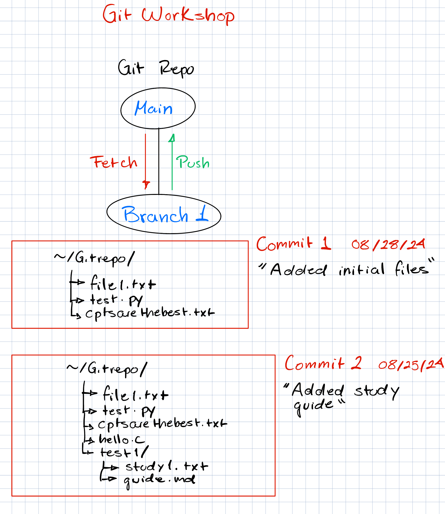

# Using git

## How does it work?

You will first create what is called a repository, this is the place where your code will be.

In our case main will be our master repository. This is the main code that will be used.

### Branches

From this main code you can create branches, this allows you to make changes without the chance of ruining the main code. Think of it as a copy of your code that you can now change with zero risks.

Use this command to create a new branch:

`git checkout -b "name_of_the_branch"`

To switch branches

`git checkout "name_of_the_branch"`

### Staging

Once we made some changes we will want to commit them, before we can do that we want to stage the files. This is like another layer to saving your files. This is so if you have two files you changed but only one is ready to commit, you can select the file to stage.

To stage your file run this command:

`git add file_name/folder_name`

TIP:

use this command to see the changes made.

`git status`

### Committing

Creating a commit creates a snapshot of all the staged files

TIP: For commit messages do you not use past tense, such as "I made headings blue". Use language like "Make headings blue", as if you are giving orders to the codebase.

This command creates a commit:

`git commit -m "description of the commit"`

